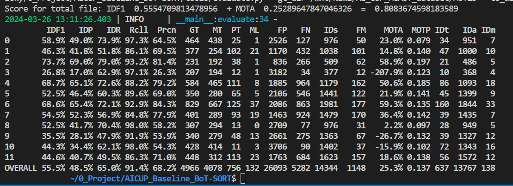

# AICUP Baseline: BoT-SORT

> [**BoT-SORT: Robust Associations Multi-Pedestrian Tracking**](https://arxiv.org/abs/2206.14651)
> 
> Nir Aharon, Roy Orfaig, Ben-Zion Bobrovsky

[](https://paperswithcode.com/sota/multi-object-tracking-on-mot17?p=bot-sort-robust-associations-multi-pedestrian)

[](https://paperswithcode.com/sota/multi-object-tracking-on-mot20-1?p=bot-sort-robust-associations-multi-pedestrian)

> [!IMPORTANT]  
> **This baseline is based on the code released by the original author of [BoT-SORT](https://github.com/NirAharon/BoT-SORT). Special thanks for their release.**


> [!WARNING]
>  - **This baseline only provides single-camera object tracking and does not include cross-camera association.**
>  - **Due to our dataset's low frame rate (fps: 1), we have disabled the Kalman filter in BoT-SORT. Low frame rates can cause the Kalman filter to deviate, hence we only used appearance features for tracking in this baseline.**


## ToDo
- [x] Complete evaluation guide
- [x] Visualize results on AICUP train_set
- [ ] Release test set

### Visualization results on AICUP train_set

[](https://youtu.be/Ofc7FS5D8uY)


## Installation

**The code was tested on Ubuntu 20.04 & 22.04**

BoT-SORT code is based on ByteTrack and FastReID. <br>
Visit their installation guides for more setup options.
 
### Setup with Conda
**Step 1.** Create Conda environment and install pytorch.
```shell
conda create -n botsort python=3.7
conda activate botsort
```
**Step 2.** Install torch and matched torchvision from [pytorch.org](https://pytorch.org/get-started/locally/).<br>
The code was tested using torch 1.11.0+cu113 and torchvision==0.12.0 

**Step 3.** Fork this Repository and clone your Repository to your device

**Step 4.** **Install numpy first!!**
```shell
pip install numpy
```

**Step 5.** Install `requirements.txt`
```shell
pip install -r requirements.txt
```

**Step 6.** Install [pycocotools](https://github.com/cocodataset/cocoapi).
```shell
pip install cython; pip3 install 'git+https://github.com/cocodataset/cocoapi.git#subdirectory=PythonAPI'
```

**Step 7.** Others
```shell
# Cython-bbox
pip install cython_bbox

# faiss cpu / gpu
pip install faiss-cpu
pip install faiss-gpu
```

## Data Preparation

Download the AI_CUP dataset, the original dataset structure is:
```python
├── train
│   ├── images
│   │   ├── 0902_150000_151900 (Timestamp: Date_StartTime_EndTime)
│   │   │  ├── 0_00001.jpg (CamID_FrameNum)
│   │   │  ├── 0_00002.jpg
│   │   │  ├── ...
│   │   │  ├── 1_00001.jpg (CamID_FrameNum)
│   │   │  ├── 1_00002.jpg
│   │   │  ├── ...
│   │   │  ├── 7_00001.jpg (CamID_FrameNum)
│   │   │  ├── 7_00002.jpg
│   │   ├── 0902_190000_191900 (Timestamp: Date_StartTime_EndTime)
│   │   │  ├── 0_00001.jpg (CamID_FrameNum)
│   │   │  ├── 0_00002.jpg
│   │   │  ├── ...
│   │   │  ├── 1_00001.jpg (CamID_FrameNum)
│   │   │  ├── 1_00002.jpg
│   │   │  ├── ...
│   │   │  ├── 7_00001.jpg (CamID_FrameNum)
│   │   │  ├── 7_00002.jpg
│   │   ├── ...
│   └── labels
│   │   ├── 0902_150000_151900 (Timestamp: Date_StartTime_EndTime)
│   │   │  ├── 0_00001.txt (CamID_FrameNum)
│   │   │  ├── 0_00002.txt
│   │   │  ├── ...
│   │   │  ├── 1_00001.txt (CamID_FrameNum)
│   │   │  ├── 1_00002.txt
│   │   │  ├── ...
│   │   │  ├── 7_00001.txt (CamID_FrameNum)
│   │   │  ├── 7_00002.txt
│   │   ├── 0902_190000_191900 (Timestamp: Date_StartTime_EndTime)
│   │   │  ├── 0_00001.txt (CamID_FrameNum)
│   │   │  ├── 0_00002.txt
│   │   │  ├── ...
│   │   │  ├── 1_00001.txt (CamID_FrameNum)
│   │   │  ├── 1_00002.txt
│   │   │  ├── ...
│   │   │  ├── 7_00001.txt (CamID_FrameNum)
│   │   │  ├── 7_00002.txt
│   │   ├── ...
--------------------------------------------------
├── test
│   ├── images
│   │   ├── 0902_150000_151900 (Timestamp: Date_StartTime_EndTime)
│   │   │  ├── 0_00001.jpg (CamID_FrameNum)
│   │   │  ├── 0_00002.jpg
│   │   │  ├── ...
│   │   │  ├── 1_00001.jpg (CamID_FrameNum)
│   │   │  ├── 1_00002.jpg
│   │   │  ├── ...
│   │   │  ├── 7_00001.jpg (CamID_FrameNum)
│   │   │  ├── 7_00002.jpg
│   │   ├── 0902_190000_191900 (Timestamp: Date_StartTime_EndTime)
│   │   │  ├── 0_00001.jpg (CamID_FrameNum)
│   │   │  ├── 0_00002.jpg
│   │   │  ├── ...
│   │   │  ├── 1_00001.jpg (CamID_FrameNum)
│   │   │  ├── 1_00002.jpg
│   │   │  ├── ...
│   │   │  ├── 7_00001.jpg (CamID_FrameNum)
│   │   │  ├── 7_00002.jpg
│   │   ├── ...
```

### Ground Truth Format
Each image corresponds to a text file, an example is provided below:

> [!WARNING]
> **The coordinates and dimensions of the Ground Truth data are normalized**

class|center_x|center_y|width   |height|track_ID|
-----|--------|--------|--------|------|--------|
0    |0.704687|0.367592|0.032291|0.1   |1       |

```python
# image_name1.txt

0 0.704687 0.367592 0.032291 0.1 1
0 0.704166 0.403703 0.030208 0.087037 2
0 0.929166 0.710185 0.051041 0.162962 3
0 0.934114 0.750925 0.084895 0.162962 4
0 0.780208 0.273148 0.023958 0.062962 5
0 0.780989 0.246296 0.022395 0.066666 6
```

### Prepare ReID Dataset

For training the ReID, detection patches must be generated as follows:   

```shell
cd <BoT-SORT_dir>

# For AICUP 
python fast_reid/datasets/generate_AICUP_patches.py --data_path <dataets_dir>/AI_CUP_MCMOT_dataset/train
```

> [!TIP]
> You can link dataset to FastReID ```export FASTREID_DATASETS=<BoT-SORT_dir>/fast_reid/datasets```. If left unset, the default is `fast_reid/datasets` 


### Prepare YOLOv7 Dataset

> [!WARNING]
> We only implemented the fine-tuning interface for `yolov7`
> If you need to change the object detection model, please do it yourself.

run the `yolov7/tools/AICUP_to_YOLOv7.py` by the following command:
```
cd <BoT-SORT_dir>
python yolov7/tools/AICUP_to_YOLOv7.py --AICUP_dir datasets/AI_CUP_MCMOT_dataset/train --YOLOv7_dir datasets/AI_CUP_MCMOT_dataset/yolo
```
The file tree after conversion by `AICUP_to_YOLOv7.py` is as follows:

```python
/datasets/AI_CUP_MCMOT_dataset/yolo
    ├── train
    │   ├── images
    │   │   ├── 0902_150000_151900_0_00001.jpg (Date_StartTime_EndTime_CamID_FrameNum)
    │   │   ├── 0902_150000_151900_0_00002.jpg
    │   │   ├── ...
    │   │   ├── 0902_150000_151900_7_00001.jpg
    │   │   ├── 0902_150000_151900_7_00002.jpg
    │   │   ├── ...
    │   └── labels
    │   │   ├── 0902_150000_151900_0_00001.txt (Date_StartTime_EndTime_CamID_FrameNum)
    │   │   ├── 0902_150000_151900_0_00002.txt
    │   │   ├── ...
    │   │   ├── 0902_150000_151900_7_00001.txt
    │   │   ├── 0902_150000_151900_7_00002.txt
    │   │   ├── ...
    ├── valid
    │   ├── images
    │   │   ├── 1015_190000_191900_0_00001.jpg (Date_StartTime_EndTime_CamID_FrameNum)
    │   │   ├── 1015_190000_191900_0_00002.jpg
    │   │   ├── ...
    │   │   ├── 1015_190000_191900_7_00001.jpg
    │   │   ├── 1015_190000_191900_7_00002.jpg
    │   │   ├── ...
    │   └── labels
    │   │   ├── 1015_190000_191900_0_00001.txt (Date_StartTime_EndTime_CamID_FrameNum)
    │   │   ├── 1015_190000_191900_0_00002.txt
    │   │   ├── ...
    │   │   ├── 1015_190000_191900_7_00001.txt
    │   │   ├── 1015_190000_191900_7_00002.txt
    │   │   ├── ...
```


## Model Zoo for MOT17 & COCO
> [!TIP]
> We recommend using YOLOv7 as the object detection model for tracking

Download and store the trained models in 'pretrained' folder as follows:
```
<BoT-SORT_dir>/pretrained
```
- We used the publicly available [ByteTrack](https://github.com/ifzhang/ByteTrack) model zoo trained on MOT17, MOT20 and ablation study for YOLOX object detection.

- Author's trained ReID models can be downloaded from [MOT17-SBS-S50](https://drive.google.com/file/d/1QZFWpoa80rqo7O-HXmlss8J8CnS7IUsN/view?usp=sharing), [MOT20-SBS-S50](https://drive.google.com/file/d/1KqPQyj6MFyftliBHEIER7m_OrGpcrJwi/view?usp=sharing).

- For multi-class MOT use [YOLOX](https://github.com/Megvii-BaseDetection/YOLOX) or [YOLOv7](https://github.com/WongKinYiu/yolov7) trained on COCO (or any custom weights). 

## Training (Fine-tuning)

### Train the ReID Module for AICUP

After generating the AICUP ReID dataset as described in the 'Data Preparation' section.

```shell
cd <BoT-SORT_dir>

# For training AICUP 
python3 fast_reid/tools/train_net.py --config-file fast_reid/configs/AICUP/bagtricks_R50-ibn.yml MODEL.DEVICE "cuda:0"
```

The training results are stored by default in ```logs/AICUP/bagtricks_R50-ibn```. The storage location and model hyperparameters can be modified in ```fast_reid/configs/AICUP/bagtricks_R50-ibn.yml```.

You can refer to `fast_reid/fastreid/config/defaults.py` to find out which hyperparameters can be modified.

Refer to [FastReID](https://github.com/JDAI-CV/fast-reid) repository for additional explanations and options.

> [!IMPORTANT]  
> Since we did not generate the `query` and `gallery` datasets required for evaluation when producing the ReID dataset (`MOT17_ReID` provided by BoT-SORT also not provide them), please skip the following TrackBack when encountered after training completion.

```shell
Traceback (most recent call last):
...
File "./fast_reid/fastreid/evaluation/reid_evaluation.py", line 107, in evaluate
    cmc, all_AP, all_INP = evaluate_rank(dist, query_pids, gallery_pids, query_camids, gallery_camids)
  File "./fast_reid/fastreid/evaluation/rank.py", line 198, in evaluate_rank
    return evaluate_cy(distmat, q_pids, g_pids, q_camids, g_camids, max_rank, use_metric_cuhk03)
  File "rank_cy.pyx", line 20, in rank_cy.evaluate_cy
  File "rank_cy.pyx", line 28, in rank_cy.evaluate_cy
  File "rank_cy.pyx", line 240, in rank_cy.eval_market1501_cy
AssertionError: Error: all query identities do not appear in gallery
```

### Fine-tune YOLOv7 for AICUP

- The dataset path is configured in `yolov7/data/AICUP.yaml`.
- The model architecture can be configured in `yolov7/cfg/training/yolov7-AICUP.yaml`.
- Training hyperparameters are configured in `yolov7/data/hyp.scratch.custom.yaml` (default is `yolov7/data/hyp.scratch.p5.yaml`).

> [!CAUTION]
> **The Hyperparameter teams cannot be adjusted for the YOLOv7 model architecture, only the Anchor box can be adjusted in `yolov7/cfg/training/yolov7-AICUP.yaml`.**

Single GPU finetuning for AICUP dataset

[`yolov7_training.pt`](https://github.com/WongKinYiu/yolov7/releases/download/v0.1/yolov7_training.pt) [`yolov7x_training.pt`](https://github.com/WongKinYiu/yolov7/releases/download/v0.1/yolov7x_training.pt) [`yolov7-w6_training.pt`](https://github.com/WongKinYiu/yolov7/releases/download/v0.1/yolov7-w6_training.pt) [`yolov7-e6_training.pt`](https://github.com/WongKinYiu/yolov7/releases/download/v0.1/yolov7-e6_training.pt) [`yolov7-d6_training.pt`](https://github.com/WongKinYiu/yolov7/releases/download/v0.1/yolov7-d6_training.pt) [`yolov7-e6e_training.pt`](https://github.com/WongKinYiu/yolov7/releases/download/v0.1/yolov7-e6e_training.pt)

``` shell
cd <BoT-SORT_dir>
# finetune p5 models
python yolov7/train.py --device 0 --batch-size 16 --epochs 50 --data yolov7/data/AICUP.yaml --img 1280 1280 --cfg yolov7/cfg/training/yolov7-AICUP.yaml --weights 'pretrained/yolov7-e6e.pt' --name yolov7-AICUP --hyp data/hyp.scratch.custom.yaml

# finetune p6 models
python yolov7/train_aux.py --device 0 --batch-size 16 --epochs 50 --data yolov7/data/AICUP.yaml --img 1280 1280 --cfg yolov7/cfg/training/yolov7-w6-AICUP.yaml --weights 'pretrained/yolov7-e6e.pt' --name yolov7-w6-AICUP --hyp data/hyp.scratch.custom.yaml
```

For multiple GPU training and other details, please refer to [YOLOv7-Training](https://github.com/WongKinYiu/yolov7?tab=readme-ov-file#training).

The training results will be saved by default at `runs/train`.

## Tracking and creating the submission file for AICUP (Demo)

> [!WARNING]
> - We only implemented the `tools/mc_demo_yolov7.py`( `mc` mean multi-class) for AICUP
> - If you need to use other tracking programs in `tools`, please do it yourself.

Track one `<timestamp>` with BoT-SORT(-ReID) based YOLOv7 and multi-class (We only output class: 'car').
```shell
cd <BoT-SORT_dir>
python3 tools/mc_demo_yolov7.py --weights pretrained/yolov7-e6e.pt --source AI_CUP_MCMOT_dataset/train/images/<timestamp> --device "0" --name "<timestamp>" --fuse-score --agnostic-nms --with-reid --fast-reid-config fast_reid/configs/AICUP/bagtricks_R50-ibn.yml --fast-reid-weights logs/AICUP/bagtricks_R50-ibn/model_00xx.pth
```

If you want to track all `<timestamps>` in the directory, you can execute the bash file we provided.
```shell
cd <BoT-SORT_dir>
bash tools/track_all_timestamps.sh --weights "pretrained/yolov7-e6e.pt" --source-dir "AI_CUP_MCMOT_dataset/train/images" --device "0" --fast-reid-config "fast_reid/configs/AICUP/bagtricks_R50-ibn.yml" --fast-reid-weights "logs/AICUP/bagtricks_R50-ibn/model_00xx.pth"
```

The submission file and visualized images will be saved by default at `runs/detect/<timestamp>`.

## Evaluation format

The evaluation format is the same as [py-motmetrics](https://github.com/cheind/py-motmetrics).

> [!CAUTION]
> **The images resolution for evaluation is `1280 * 720`**

frame_id| track_id | bb_left|  bb_top | bb_width |bb_height|conf|3d_x|3d_y|3d_z|
--------| -------- | -------| --------| ---------|-------- |----|----|----|----|
1       |1         |843     |742      | 30       |30       |0.8 |-1  |-1  |-1  |

## Evaluate your submission

Before evaluation, you need to run `tools/datasets/AICUP_to_MOT15.py` to convert ground truth into submission format:

```bash
cd <BoT-SORT_dir>
python tools/datasets/AICUP_to_MOT15.py --AICUP_dir "your AICUP dataset path" --MOT15_dir "converted dataset directory" --imgsz "img size, (height, width)"
```

You can use `tools/evaluate.py` to evaluate your submission by the following command:

```bash
cd <BoT-SORT_dir>
python tools/evaluate.py --gt_dir "Path to the ground truth directory" --ts_dir "Path to the tracking result directory"
```

The `gt_dir` and `ts_dir` file trees are as follows:

```python
├── gt_dir
│   ├── 0902_150000_151900.txt
│   ├── 0902_190000_191900.txt
│   ├── ...
├── ts_dir
│   ├── 0902_150000_151900.txt
│   ├── 0902_190000_191900.txt
│   ├── ...
```

Then you can get the result:


## Note

Our camera motion compensation module is based on the OpenCV contrib C++ version of VideoStab Global Motion Estimation, 
which currently does not have a Python version. <br>
Motion files can be generated using the C++ project called 'VideoCameraCorrection' in the GMC folder. <br> 
The generated files can be used from the tracker. <br>

In addition, python-based motion estimation techniques are available and can be chosen by passing <br> 
'--cmc-method' <files | orb | ecc> to demo.py or track.py. 

## Citation

```
@article{aharon2022bot,
  title={BoT-SORT: Robust Associations Multi-Pedestrian Tracking},
  author={Aharon, Nir and Orfaig, Roy and Bobrovsky, Ben-Zion},
  journal={arXiv preprint arXiv:2206.14651},
  year={2022}
}
```


## Acknowledgement

A large part of the codes, ideas and results are borrowed from
- [BoT-SORT](https://github.com/NirAharon/BoT-SORT)
- [ByteTrack](https://github.com/ifzhang/ByteTrack)
- [StrongSORT](https://github.com/dyhBUPT/StrongSORT)
- [FastReID](https://github.com/JDAI-CV/fast-reid)
- [YOLOX](https://github.com/Megvii-BaseDetection/YOLOX)
- [YOLOv7](https://github.com/wongkinyiu/yolov7)

Thanks for their excellent work!


## Ours Environment
All environments were set up according to the baseline instructions. The version of the environment upon completion is as follows:

OS:ubuntu 20.04
CPU: Intel i9-10940X
GPU:NVIDIA RTX 4090-24G 
RAM:128GB
Python:3.7.16
Package                  Version
------------------------ --------------------
absl-py                  2.1.0
beautifulsoup4           4.12.3
cachetools               5.3.3
certifi                  2022.12.7
charset-normalizer       3.3.2
cycler                   0.11.0
Cython                   3.0.10
cython-bbox              0.1.5
easydict                 1.13
faiss-gpu                1.7.2
filelock                 3.12.2
filterpy                 1.4.5
flatbuffers              24.3.25
fonttools                4.38.0
gdown                    4.7.3
google-auth              2.29.0
google-auth-oauthlib     0.4.6
grpcio                   1.62.2
h5py                     3.8.0
idna                     3.7
imageio                  2.31.2
importlib-metadata       6.7.0
joblib                   1.3.2
kiwisolver               1.4.5
lap                      0.4.0
loguru                   0.7.2
Markdown                 3.4.4
MarkupSafe               2.1.5
matplotlib               3.5.3
networkx                 2.6.3
ninja                    1.11.1.1
numpy                    1.21.6
nvidia-cublas-cu11       11.10.3.66
nvidia-cuda-nvrtc-cu11   11.7.99
nvidia-cuda-runtime-cu11 11.7.99
nvidia-cudnn-cu11        8.5.0.96
oauthlib                 3.2.2
onnx                     1.8.1
onnx-simplifier          0.3.5
onnxoptimizer            0.3.13
onnxruntime              1.8.0
opencv-python            4.9.0.80
packaging                24.0
pandas                   1.3.5
Pillow                   9.5.0
pip                      22.3.1
prettytable              3.7.0
protobuf                 3.20.3
pyasn1                   0.5.1
pyasn1-modules           0.3.0
pycocotools              2.0
pyparsing                3.1.2
PySocks                  1.7.1
python-dateutil          2.9.0.post0
pytz                     2024.1
PyWavelets               1.3.0
PyYAML                   6.0.1
requests                 2.31.0
requests-oauthlib        2.0.0
rsa                      4.9
scikit-image             0.19.3
scikit-learn             1.0.2
scipy                    1.7.3
seaborn                  0.12.2
setuptools               65.6.3
six                      1.16.0
soupsieve                2.4.1
tabulate                 0.9.0
tensorboard              2.11.2
tensorboard-data-server  0.6.1
tensorboard-plugin-wit   1.8.1
termcolor                2.3.0
thop                     0.1.1.post2209072238
threadpoolctl            3.1.0
tifffile                 2021.11.2
torch                    1.13.1
torchvision              0.14.1
tqdm                     4.66.2
typing_extensions        4.7.1
urllib3                  2.0.7
wcwidth                  0.2.13
Werkzeug                 2.2.3
wheel                    0.38.4
xmltodict                0.13.0
yacs                     0.1.8
zipp                     3.15.0


